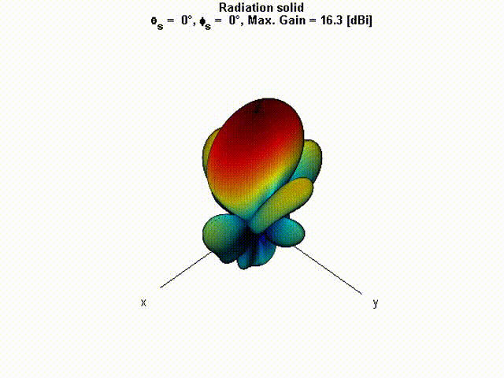

# N2F in MATLAB
Near-field to far-field (N2F) transformations code for model order reduction in finite element radiation computations. This project implements efficient algorithms for computing far-field patterns from near-field data using Huygens' principle and low-rank approximations.

## Example patch antenna array 3x5 scanning


## Project Overview

This MATLAB library provides tools for:
- **Near-field computation**: Computing electromagnetic fields and their derivatives on bounding surfaces
- **Far-field transformations**: Converting near-field data to far-field radiation patterns
- **Model order reduction**: Using SVD-based techniques to reduce computational complexity
- **Geometric construction**: Building arrays, boxes, and spherical surfaces for analysis
- **Visualization**: Plotting field patterns, array geometries, and error metrics

## Directory Structure

### `matlabLib/`
Core library functions organized by functionality:

#### Geometry Functions
- `buildArray()` - Create antenna array positions
- `buildBox()` - Construct rectangular bounding surfaces
- `buildSphere()` - Create spherical sampling surfaces
- `buildTriSphere()` - Build triangulated sphere meshes
- `getBoxDim()` - Calculate bounding box dimensions
- `getBoxVectors()` - Compute vectors for box-based N2F
- `getSphVectors()` - Compute vectors for sphere-based N2F
- `getSphRadius()` - Determine optimal sphere radius

#### Coordinate/Transform Functions
- `cartesian2spherical()` - Convert Cartesian to spherical coordinates
- `spherical2cartesian()` - Convert spherical to Cartesian coordinates
- `getRotationMatrix()` - Generate rotation transformation matrices
- `crossOperator()` - Compute cross product operations
- `vector2matrix()` - Vector-to-matrix conversions

#### Scalar Field Solvers
- `sf_nfSolver()` - Compute scalar near fields and derivatives
- `sf_nf2ffSolver()` - Transform scalar near fields to far fields
- `sf_directffSolver()` - Direct far-field computation for validation
- `sf_nf2ffOperator()` - Construct N2F operator matrices
- `sf_excitations()` - Define excitation sources
- `sf_computeGain()` - Calculate radiation gain

#### Vector Field Solvers
- `vf_nfSolver()` - Compute vector near fields (E, H fields)
- `vf_nf2ffSolver()` - Transform vector near fields to far fields
- `vf_n2fOpFields()` - Vector N2F operator matrices
- `vf_n2fOpFieldsFFT()` - FFT-based vector N2F operators
- `vf_directffSolver()` - Direct vector far-field computation
- `vf_computeGain()` - Vector field gain calculation

#### Utility Functions
- `deg2rad()`, `rad2deg()` - Angle conversions
- `getSpanningAngles()` - Generate angular sampling patterns
- `getSphSmplAngles()`, `getSphSmplAnglesForPlots()` - Spherical angle sampling
- `getL1error()`, `getL2error()`, `getMaxError()` - Error metrics
- `getColorMap()`, `getFigureProperties()` - Visualization utilities

#### Plotting Functions
- `plotSphGeom()` - Plot spherical geometry
- `plotFFCutPlanes()` - Visualize far-field cut planes
- `plotArrayGeom()` - Display array configuration
- `plotSelectedAngles()` - Plot specific angular regions
- `sf_plotSphNF()`, `vf_plotFF3d()` - Field visualization

### `scalarField/`
Test and example scripts for scalar field (single value field) problems:

#### `sphere/`
- `test_Fields_SVD.m` - Low-rank SVD approximation of near fields on sphere
- `test_Fields_SVD_*.m` - Variants with different angle selection strategies:
  - `LinearAnglesSelection` - Uniform angle sampling
  - `LinearInverseAnglesSelection` - Non-uniform angle distributions
  - `ExponentialAnglesSelection` - Exponential angle sampling
  - `HemisphereScanning` - Hemisphere-only scanning
  - `AveragedError` - Error averaging over multiple configurations
- `test_Operator_SVD.m` - SVD decomposition of N2F operators
- `test_Operator.m` - Low-rank operator approximation
- `show_SphereN2F.m` - Example N2F transformation on sphere
- `show_SphereN2F_Errors.m` - Demonstrate error metrics

#### `box/`
Similar tests adapted for rectangular bounding boxes:
- `test_Fields_SVD.m` - SVD analysis on box surfaces
- `test_Operator.m` - Operator reduction for boxed geometries
- `show_BoxN2F.m` - N2F on box surfaces
- `show_PlanesN2F.m` - N2F on individual planes

### `vectorFields/`
Corresponding tests for vector field (E and H field) problems with `sphere/` and `box/` subdirectories

## Core Algorithms

### Scalar Field N2F Transformation
Implements Huygens' principle for scalar fields:
```
f(θ,φ) = ∫∫_S [(ikn·R̂)ψ - ∂ψ/∂n] exp(ikR)/4πR dS
```
where:
- `ψ` = near field
- `∂ψ/∂n` = normal derivative
- `k` = wavenumber
- `R` = distance from surface to far-field point

### Vector Field N2F Transformation
Uses Kottler's equations to relate tangential E/H fields on surface to far-field patterns:
```
E(θ,φ) = ik₀Z₀/4π ∫∫_S [J(1+ikR)⁻¹ + (J·R̂)R̂(3(ikR)⁻² + 3i(ikR)⁻³)]exp(-ik₀R) dS
                    - k₀²/4π M×R̂[(ikR)⁻¹ + (kR)⁻²]exp(-ik₀R)
```

### Low-Rank Approximation
SVD-based model order reduction applied to N2F operator matrices to reduce computational load.

## Usage Examples

### Basic Scalar Field N2F on Sphere
```matlab
addpath('matlabLib');

% Create antenna array
arrayPos = buildArray(1, 9, 0.5, 5, 0.5);

% Build spherical sampling surface
radius = getSphRadius(1, arrayPos, 0.5);
[spherePos, dS, thetaNF, phiNF, mSize] = buildSphere(radius, 0.1, 3, 3, 1);

% Compute near field
[Rmag, NdotRV, n] = getSphVectors(arrayPos, spherePos);
excitPhasor = sf_excitations(1, arrayPos, 23.3, 0);
[psi, delPsi] = sf_nfSolver(1, excitPhasor, Rmag, NdotRV);

% Transform to far field
thetaFF = deg2rad(-90:1:90);
phiFF = deg2rad([0 90]);
farField = sf_nf2ffSolver(1, thetaFF, phiFF, spherePos, n, dS, psi, delPsi);
```

### Scalar Field N2F with Low-Rank Approximation
```matlab
% Create bounding box
[xMin, xMax, yMin, yMax, zMin, zMax, xPts, yPts, zPts] = ...
  getBoxDim(1, arrayPos, 0.5, 0.1, 0.5);
[boxPos, boxN, dS, mSize] = buildBox(...
  [1 1 1 1 1 1], xMin, xMax, yMin, yMax, zMin, zMax, xPts, yPts, zPts, 1, 0, 0);

% Compute fields and operator
[Rmag, NdotRV] = getBoxVectors(arrayPos, boxPos, boxN);
excitPhasor = sf_excitations(1, arrayPos, 0, 0);
[psi, delPsi] = sf_nfSolver(1, excitPhasor, Rmag, NdotRV);

% Build N2F operator matrices
[Lpsi, LdelPsi] = sf_nf2ffOperator(1, thetaFF, phiFF, boxPos, boxN, dS);

% Apply operator
farField = zeros(length(phiFF), length(thetaFF));
for i = 1:length(phiFF)
  farField(i,:) = Lpsi(:,:,i) * psi.' + LdelPsi(:,:,i) * delPsi.';
end
```

## Key Functions Reference

### `sf_nfSolver(lambda, excitPhasor, Rmag, NdotRV)`
Computes scalar near field and its normal derivative on a surface using superposition of point sources.

**Inputs:**
- `lambda` - Wavelength [m]
- `excitPhasor` - Source excitation phasors
- `Rmag` - Distance matrix from sources to surface points
- `NdotRV` - Dot products for derivative computation

**Outputs:**
- `psi` - Near field values
- `delPsi` - Normal field derivatives

### `sf_nf2ffSolver(lambda, theta, phi, surfPos, N, dS, psi, delPsi)`
Transforms scalar near field to far-field using Huygens' principle.

**Inputs:**
- `theta, phi` - Far-field observation angles
- `surfPos` - Surface sampling point coordinates (3×N)
- `N` - Outward normal vectors (3×N)
- `dS` - Surface patch areas (1×N)

**Outputs:**
- `fPsi` - Far-field radiation pattern (len(phi) × len(theta))

### `buildArray(lambda, nx, dx, ny, dy)`
Creates rectangular antenna array positions.

**Inputs:**
- `lambda` - Wavelength (for scaling)
- `nx, ny` - Number of elements in x and y
- `dx, dy` - Element spacings

**Outputs:**
- Array position matrix (3×(nx×ny))

### `buildSphere(radius, resolution, thetaRes, phiRes, type)`
Constructs spherical sampling surface.

**Inputs:**
- `radius` - Sphere radius
- `resolution` - Mesh resolution parameter
- `thetaRes, phiRes` - Angular resolutions

**Outputs:**
- `spherePos` - Surface point coordinates
- `dS` - Patch areas
- `thetaNF, phiNF` - Sampling angles
- `mSize` - Mesh dimensions

## Testing

Run test scripts from their respective directories:
```matlab
cd scalarField/sphere
test_Fields_SVD
```

Test scripts validate the implementation against direct far-field solvers and measure error metrics (L1, L2, max error).

## Author
Laurent Ntibarikure
